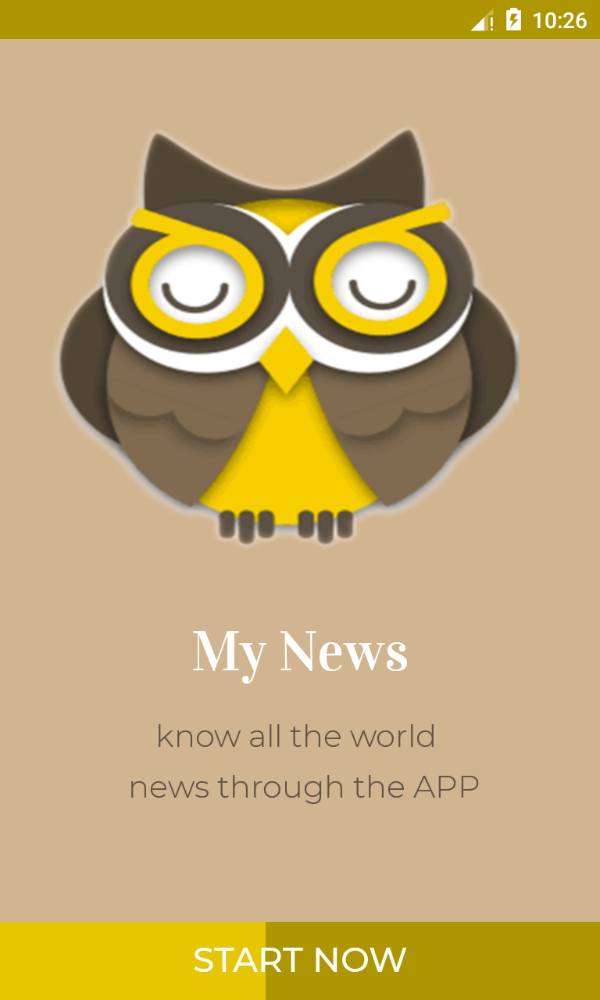
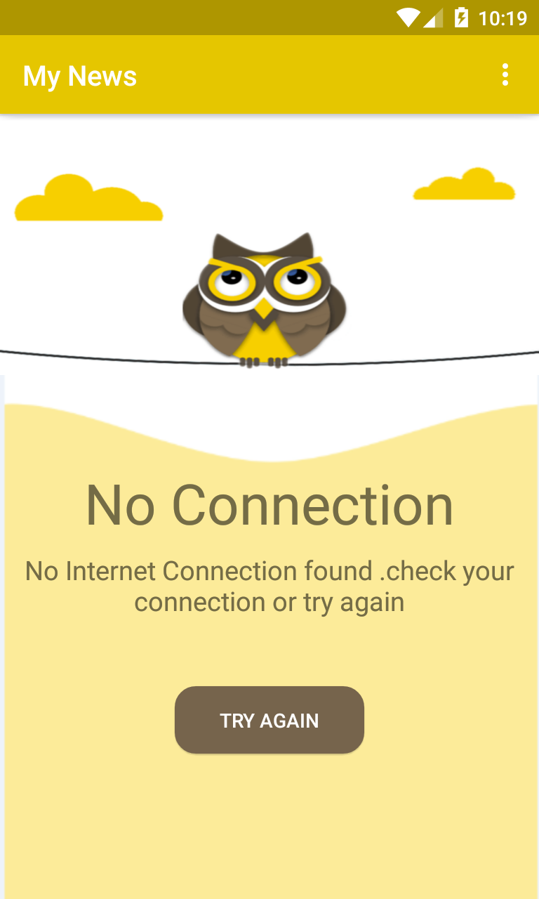
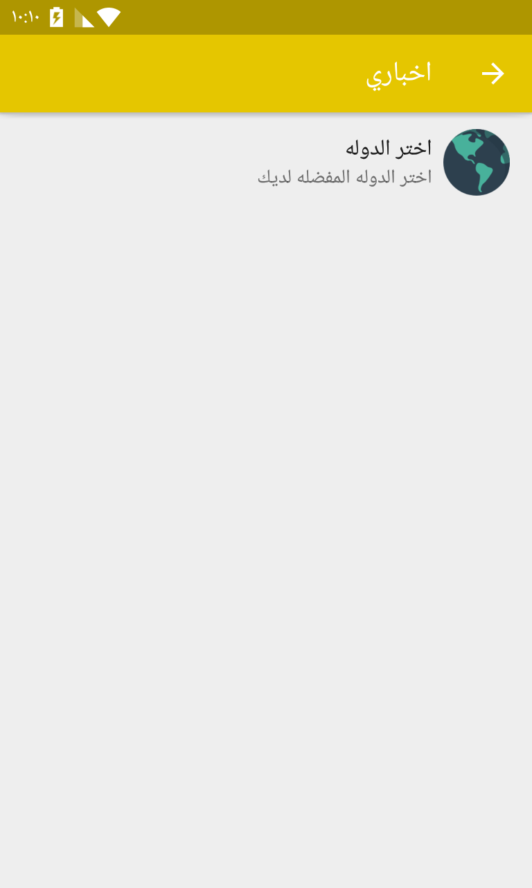

# News App
-----------

A simple Android app, that helps user to discover break news around the world. user can choose 
the country and app will fetch news for this country from  * [News API](https://newsapi.org//) - Get breaking news headlines

Screenshots
-----------
* **When the default language** - *English*

  
   
  
  

  

 

* **When the default language** - *Arabic*

  
   
  

  
   

Demo
-----------
* [App demo ](https://www.youtube.com/watch?v=9c0-NNM9wvQ) 
# Developer setup
-----------

**Requirements:**

- Java 8
- Latest version of Android SDK and Android Build Tools

#### App Specs
* Minimum SDK 16
* [Java8](https://java.com/en/download/faq/java8.xml) (in master branch)
* [MVVM Architecture](https://github.com/googlesamples/android-architecture) .
* [Android Architecture Components] (https://developer.android.com/topic/libraries/architecture) :are a collection of libraries that help you design robust, testable, and maintainable apps. 
Start with classes for managing your UI component lifecycle and handling data persistence.
- [LiveData](https://developer.android.com/topic/libraries/architecture/livedata) is an observable data holder class.  .
- [ViewModel](https://developer.android.com/topic/libraries/architecture/viewmodel) allows data to survive configuration changes such as screen rotations..
- [databinding](https://developer.android.com/topic/libraries/data-binding)  is a support library that allows you to bind UI components in your layouts to data 
sources in your app using a declarative format rather than programmatically..
- [Paging library]: https://developer.android.com/topic/libraries/architecture/paging

 * [Retrofit 2](https://square.github.io/retrofit/) for API integration.
* [Gson](https://github.com/google/gson) for serialisation.
* [Glide](https://github.com/bumptech/glide) for image loading.
